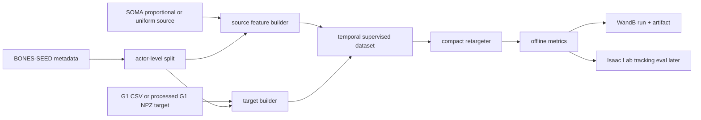
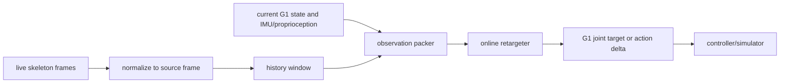

# Architecture

Goal: a compact online retargeter that maps heterogeneous human skeleton motion to Unitree G1 motion references with sub-1 ms inference on an RTX 4090.

## Baseline Scope

First baseline: direct G1 output.

Do not start with VAE/diffusion/flow. Those are design branches after direct output has measured failure modes.

## Training Pipeline

## Inference Pipeline

## Observation Design

Initial observation blocks:

- Source skeleton history: local joint/body positions, orientations if available, velocities, and contact proxies.
- Source morphology: actor height, foot length, shoulder/hip/knee/ankle measurements, and skeleton ID embedding only if needed.
- Robot state: current G1 joint position, joint velocity, previous action, base orientation/IMU roll-pitch, angular velocity.
- Optional future: short future source window if online latency permits buffering.

The first model should accept a fixed-width flattened window. A more expressive tokenized transformer is only justified after the MLP baseline is measured.

## Output Design

Default output: 29-dimensional G1 joint target delta or next joint position.

Alternatives:

- Full generalized coordinate target: root plus 29 joints. Useful for offline reference generation, less direct for onboard control.
- Latent output: requires VAE encoder/decoder and a clear metric showing it improves generalization or smoothness.
- Short-horizon output: may improve temporal consistency, but increases output size and latency.

## Model Families

| Family | Use | Risk |
| --- | --- | --- |
| Temporal MLP | First baseline, easiest to deploy under 1 ms | Limited global context |
| Tiny temporal transformer | If MLP cannot smooth noisy long-context inputs | Latency and overfitting |
| VAE latent model | If direct output is unstable across skeletons | More moving parts and harder metrics |
| Flow/diffusion | Offline refinement or distillation target | Multi-step inference likely violates 1 ms unless distilled |
| PDF-HR-style pose prior | Regularizer/scorer for G1 plausibility | Needs high-quality positive pose set |

## Losses

First supervised loss set:

- G1 joint position loss.
- G1 joint velocity loss.
- Body MPJPE/body position loss when `body_pos_w` or FK is available.
- Smoothness penalty on output deltas.
- Joint limit penalty after simulator joint limits are confirmed.
- Action similarity loss as cosine alignment over action/joint-delta vectors.

Later physics-aware losses:

- Foot sliding and ground penetration.
- Self-collision/self-intersection.
- Tracking policy success in Isaac Lab.
- PDF-HR-style pose prior distance.

## Metrics

Offline metrics live in `src/online_retarget/metrics.py` and must remain training-independent.

Initial metrics:

- `mpjpe`: body/joint position error.
- `joint_rmse`: G1 joint-space RMSE.
- `action_similarity`: cosine similarity over predicted vs target action/delta vectors.
- `joint_jump_rate`: thresholded velocity discontinuity rate.
- `joint_limit_violation_rate`: thresholded limit violation rate.

Future simulator metrics:

- Tracking success rate.
- Episode length / fall rate.
- World-frame MPJPE.
- Contact/foot sliding.
- Sim-to-sim robustness under noise and latency.

## Latency Gate

The online model is not accepted until measured on target hardware. The benchmark must report:

- batch size 1 latency
- warmup count
- p50/p95/p99 latency
- device, dtype, and compile/export mode
- parameter count and activation footprint

The default acceptance target is p95 under 1 ms on RTX 4090.
