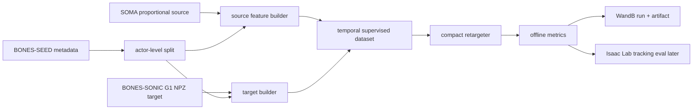
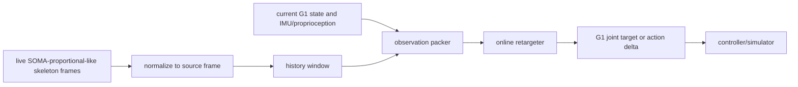

# Architecture

Goal: a compact online retargeter that maps BONES-SEED SOMA proportional human motion to Unitree G1 motion references with sub-1 ms inference on an RTX 4090.

Active problem definition: `SOMA proportional -> G1`. The source is actor-specific SOMA proportional BVH plus morphology/shape conditioning; the target is direct Unitree G1 motion, initially 29D joint position from the BONES-SONIC NPZ lane. `SOMA uniform -> G1` is an ablation, not the main task.

## Baseline Scope

First baseline: direct G1 output.

Do not start with VAE/diffusion/flow. Those are design branches after direct output has measured failure modes.

## Training Pipeline

## Inference Pipeline

## Observation Design

Initial observation blocks:

- Source skeleton history: local joint/body positions, orientations if available, velocities, and contact proxies.
- Source morphology: actor height, foot length, shoulder/hip/knee/ankle measurements, SOMA shape parameters, and skeleton ID embedding only if needed.
- Robot state: current G1 joint position, joint velocity, previous action, base orientation/IMU roll-pitch, angular velocity.
- Optional future: short future source window if online latency permits buffering.

The first model should accept a fixed-width flattened window. A more expressive tokenized transformer is only justified after the MLP baseline is measured.

Mid-term design choice: add a skeleton encoder between raw source windows and the retargeter. The encoder would convert SOMA skeleton structure, bone proportions, joint topology, local motion features, contacts, and optional shape parameters into learned skeleton/motion features, then feed those features to the direct G1 retargeter. This is not part of the first baseline, but it is a likely next branch if flattened FK windows plus morphology are not enough to capture cross-person motion semantics and skeleton-specific constraints.

Current schema implementation:

- `MotionPairRef` in `src/online_retarget/data/schema.py` consumes `split_index.csv` rows.
- `ObservationSpec(history_frames=8, source_body_count=30)` has flattened dim 1,547:
  - source history positions + velocities: 1,440
  - morphology: 13
  - robot state side channel: 94
- `OutputSpec` defaults to direct 29D G1 joint position delta.

## Output Design

Default output: 29-dimensional G1 joint target delta or next joint position.

Alternatives:

- Full generalized coordinate target: root plus 29 joints. Useful for offline reference generation, less direct for onboard control.
- Latent output: requires VAE encoder/decoder and a clear metric showing it improves generalization or smoothness.
- Short-horizon output: may improve temporal consistency, but increases output size and latency.

## Model Families

| Family | Use | Risk |
| --- | --- | --- |
| Temporal MLP | First baseline, easiest to deploy under 1 ms | Limited global context |
| Mid-term skeleton encoder + retargeter | If raw flattened windows underfit cross-skeleton semantics; encodes topology/proportions/local motion into reusable features before G1 prediction | Adds another representation boundary and must prove gains on actor-heldout eval |
| Tiny temporal transformer | If MLP cannot smooth noisy long-context inputs | Latency and overfitting |
| VAE latent model | If direct output is unstable across skeletons | More moving parts and harder metrics |
| Flow/diffusion | Offline refinement or distillation target | Multi-step inference likely violates 1 ms unless distilled |
| PDF-HR-style pose prior | Regularizer/scorer for G1 plausibility | Needs high-quality positive pose set |

## Losses

First supervised loss set:

- G1 joint position loss.
- G1 joint velocity loss.
- Body MPJPE/body position loss when `body_pos_w` or FK is available.
- Smoothness penalty on output deltas.
- Joint limit penalty after simulator joint limits are confirmed.
- Action similarity loss as cosine alignment over action/joint-delta vectors.

Later physics-aware losses:

- Foot sliding and ground penetration.
- Self-collision/self-intersection.
- Tracking policy success in Isaac Lab.
- PDF-HR-style pose prior distance.

## Metrics

Offline metrics live in `src/online_retarget/metrics.py` and must remain training-independent.

Initial metrics:

- `mpjpe`: body/joint position error.
- `joint_mae`: mean absolute G1 joint-space error; this is the eval-side counterpart of the NMR-style L1 supervised baseline.
- `joint_mse`: mean squared G1 joint-space error for comparison against older MSE smoke runs.
- `joint_rmse`: G1 joint-space RMSE.
- `max_joint_abs_error`: worst per-sample joint residual for catching localized mapping failures hidden by averages.
- `joint_velocity_rmse`: velocity-space residual when sequence predictions contain at least two frames.
- `action_similarity`: cosine similarity over predicted vs target action/delta vectors.
- `predicted_joint_jump_rate`, `target_joint_jump_rate`, and `predicted_minus_target_joint_jump_rate`: thresholded velocity discontinuity diagnostics for separating target-data artifacts from model-introduced artifacts.
- `joint_limit_violation_rate`: thresholded limit violation rate.
- `contact_artifact_metrics`: target-contact-aware foot float, contact slide, ground penetration, and clearance metrics for JSONL samples with body positions and foot body metadata.

Current eval implementation:

- `src/online_retarget/evaluation.py` evaluates JSONL prediction/target records.
- CLI: `PYTHONPATH=src python3 scripts/inspect_bones_seed.py offline-eval --input-jsonl <path> --output-root runs --run-name <name>`.
- Outputs: `eval_summary.json`, `per_sample_metrics.csv`, and `failure_manifest.csv`.
- Grouping: overall, per actor, per category, per package, and per quality flag.
- Optional contact artifact metrics are emitted when a JSONL row provides `predicted_body_pos`, `target_body_pos`, and either `foot_indices` or `body_names` plus `foot_body_names`/`foot_names`. Contact frames are inferred from the target body positions so the metric catches predicted floating or skating during target support.

Future simulator metrics:

- Tracking success rate.
- Episode length / fall rate.
- World-frame MPJPE.
- Contact/foot sliding.
- Sim-to-sim robustness under noise and latency.

## Latency Gate

The online model is not accepted until measured on target hardware. The benchmark must report:

- batch size 1 latency
- warmup count
- p50/p95/p99 latency
- device, dtype, and compile/export mode
- parameter count and activation footprint

The default acceptance target is p95 under 1 ms on RTX 4090.

Current benchmark scaffold:

- `scripts/benchmark_latency.py --dry-run` records observation/output dimensions and model hidden dims without importing torch.
- Non-dry-run requires torch and target hardware, then reports p50/p95/p99/mean/max latency plus parameter count.

## Simulator Gate

Current Isaac Lab scaffold:

- `scripts/eval_isaac.py --dry-run` writes an `isaac_eval_status.json` with expected simulator metrics.
- Non-dry-run explicitly blocks until Isaac Lab and a G1 replay/tracking task binding are available.
